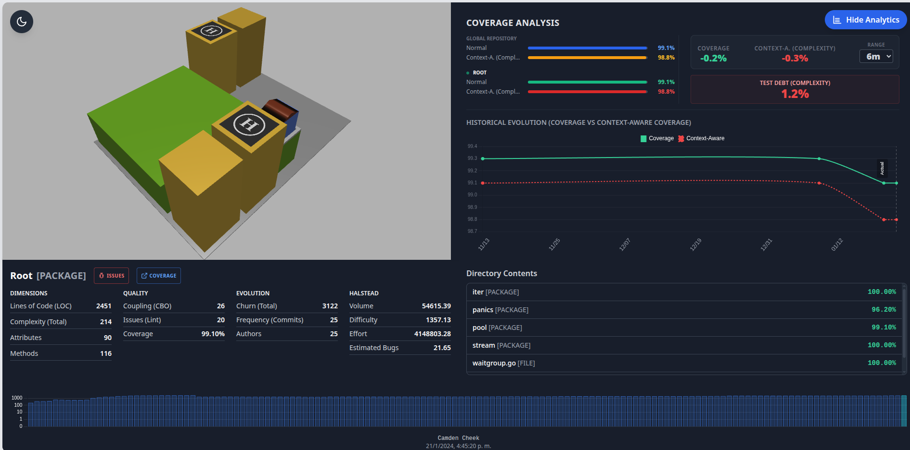
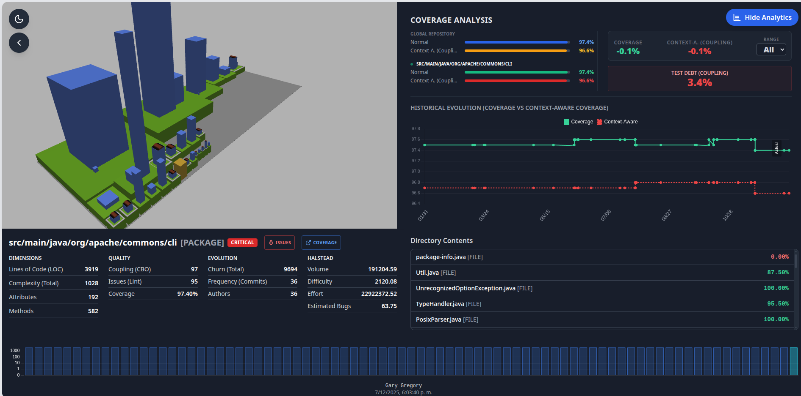
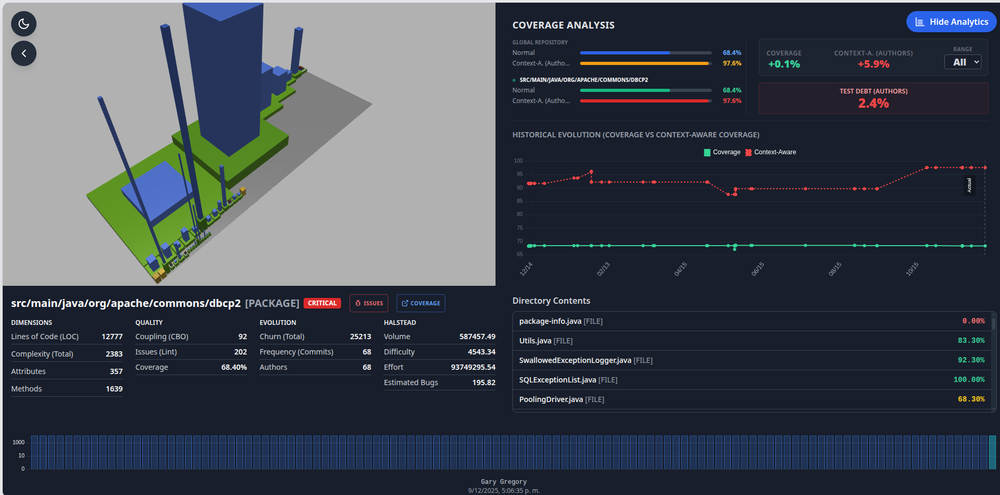
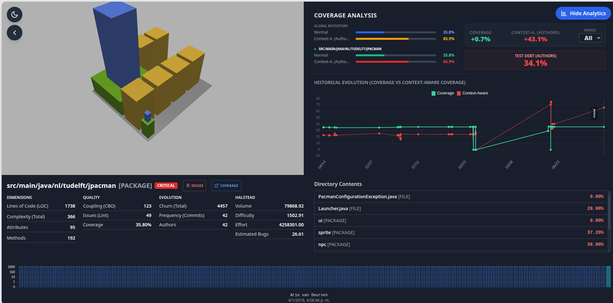
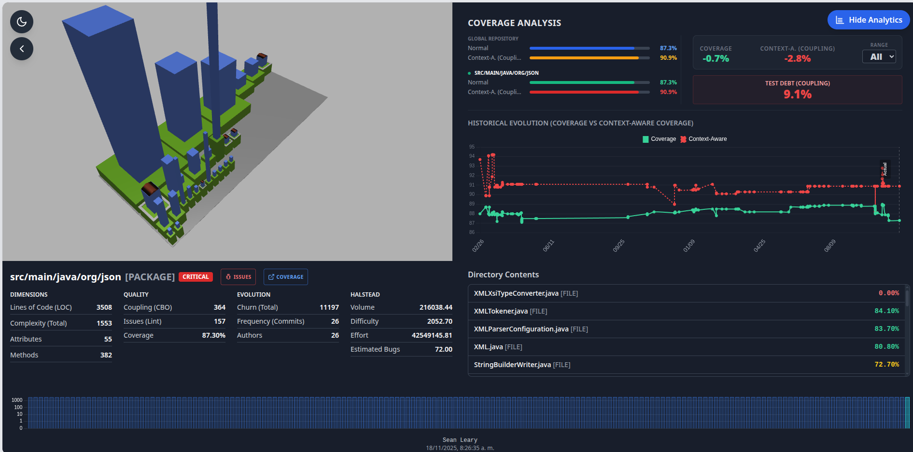

# HeatMetro: A 3D Code Visualization for Test Debt Analysis in Evolving Systems

[](https://opensource.org/licenses/Apache-2.0)


**HeatMetro** is a tool based on the Code City metaphor designed to visualize Test Debt in Java and Go projects. It operationalizes the **Context-Aware Code Coverage** criteria to highlight critical components where high complexity and churn intersect with low test reliability.

This repository contains the replication package and detailed instructions to execute the **Builder** (analysis engine) and generate the 3D visualization (**Deployment**).

---

## 1. Construction and Extraction Module (Builder)

The following demonstration video illustrates the data generation process and the usage of the analysis engine:

[](https://www.youtube.com/watch?v=NQVSQS4jM30)

### Environment Configuration

To initiate the analysis process, it is mandatory to configure the access credentials. Create a `.env` file in the root directory of the Builder with the following content:

```ini
# .env

# Personal GitHub Token (Classic Token) with read permissions (scope: repo)
GITHUB_TOKEN=ghp_your_personal_github_token_here

# SonarCloud Token (required for internal validations and analysis)
SONAR_TOKEN=your_sonar_token_here
```

### Service Execution

Once the environment variables are configured, deploy the container infrastructure by executing:

```bash
docker compose up --build
```

The service will be available at **`http://localhost:80`**.

### Analysis Procedure

1. Enter the URL of the GitHub repository to be analyzed.
2. Select the specific **branch** or **tag**.
3. The interface will request a `sonar-project.properties` configuration file. Use the following template, ensuring to **update the credentials** (`organization`, `projectKey`, etc.) with those of your SonarCloud project:

```properties
sonar.organization=shinji
sonar.projectKey=shinji_conc-vis
sonar.projectName=conc_vis
sonar.host.url=https://sonarcloud.io

# Specific configuration for Go (adjust according to language)
sonar.language=go
sonar.inclusions=**/*.go
sonar.sources=.
sonar.go.coverage.reportPaths=coverage.out
sonar.exclusions=**/.github/**,**/vendor/**
sonar.coverage.exclusions=**/*_test.go
```

4. Execute the analysis on the desired commits.
5. Upon completion, **download the generated `.db` file**. This file is essential for the visualization stage.

---

## 2. Integration and Deployment Flow (Deployer)

[](https://www.youtube.com/watch?v=WDgcQzWUqCk)

Instructions for processing the database and deploying the visualization tool locally:

### Data Processing

1. Locate the `generator` folder in the repository.
2. Transfer the `repositories.db` file (downloaded in the previous stage) to this folder.
3. Execute the conversion script to generate the necessary JSON files:

```bash
npm install
node json.js
```

This process will create a folder named `data`.

### Frontend Execution

1. Copy the `data` folder generated in the previous step.
2. Paste it inside the `public` directory of the HeatMetro frontend project.
3. Start the application in development mode:

```bash
npm install
npm run start
```

The interactive tool will be ready for use in the browser.

---

## 3. Case Studies and Analyzed Projects

Below are the open-source projects that have been analyzed and visualized using **HeatMetro**. Click on the corresponding image to access the interactive visualization for each project.

|                                                       Analyzed Projects                                                        |
| :----------------------------------------------------------------------------------------------------------------------------: |
|                [](https://shinjimc.github.io/conc_vis/) <br> **sourcegraph/conc (GO)**                 |
|              [](https://shinjimc.github.io/kagome-vis/) <br> **ikawaha/kagome (GO)**               |
|          [](https://shinjimc.github.io/commons-cli-vis/) <br> **apache/commons-cli (Java)**           |
|         [](https://shinjimc.github.io/commons-dbcp-vis/) <br> **apache/commons-dbcp (Java)**         |
| [](https://shinjimc.github.io/jpacman-framework-vis/) <br> **SERG-Delft/jpacman-framework (Java)** |
|           [](https://shinjimc.github.io/JSON-java-vis/) <br> **stleary/JSON-java (Java)**            |

---

## Author

- **Braulio Nayap Maldonado Casilla** - [GitHub Profile](https://github.com/ShinjiMC)

## License

This project is licensed under the Apache 2.0 License. See the [LICENSE](https://www.google.com/search?q=LICENSE) file for details.
