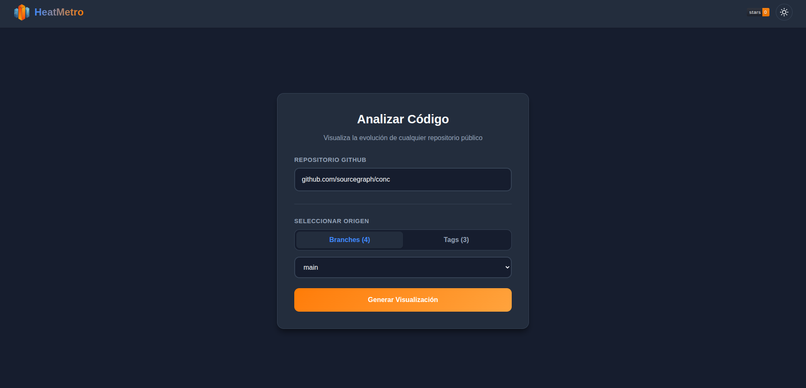
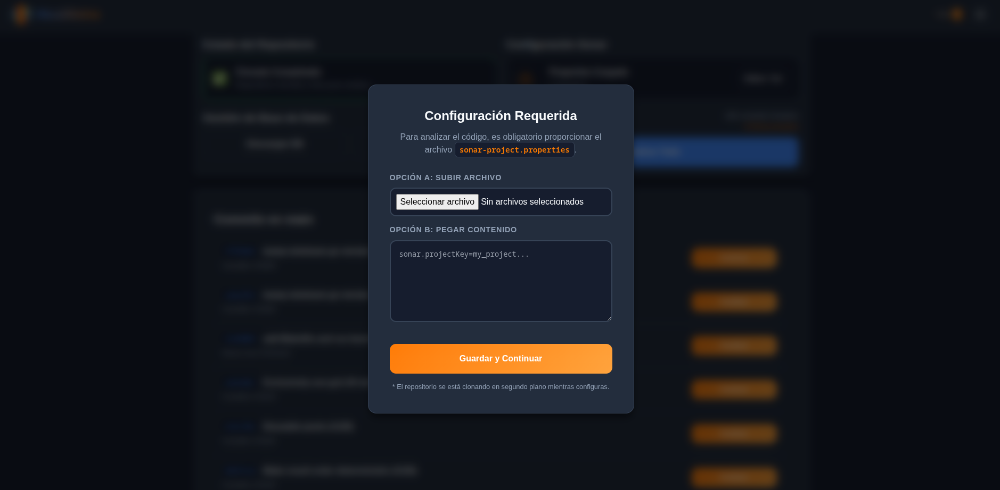
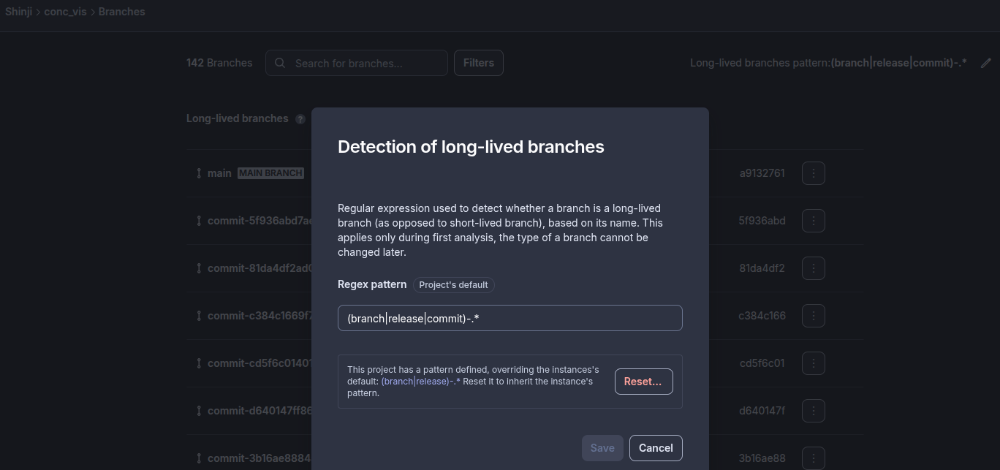

# HeatMetro: Builder

<a href="https://opensource.org/licenses/MIT">

</a>

> **[Leer en Español](#heatmetro-builder-español)**

---

## HeatMetro: Builder (English)

**HeatMetro: Builder** is an automated code analysis platform designed using a microservices architecture. Its primary purpose is to visualize software quality metrics—specifically Halstead metrics, Code Churn, Cyclomatic Complexity, and Cohesion—extracted from GitHub repositories through heatmaps and evolutionary charts.

The system orchestrates repository cloning, static analysis for various languages (Go, JS, TS), and metric persistence by utilizing **Docker** containerization and **Nginx** as a reverse proxy.


### Prerequisites

Ensure the following software is installed on the host system:

- **Docker** (version 20.10 or higher)
- **Docker Compose** (version 2.0 or higher)

### Initial Configuration

Before executing the project, it is mandatory to configure the access credentials via environment variables.

1. Create a file named `.env` in the root directory of the project (at the same level as `docker-compose.yml`).
2. Insert the following content, replacing the placeholder values with valid tokens:

```ini
# .env

# Personal GitHub Token (Classic Token) with repository read permissions (scope: repo)
GITHUB_TOKEN=ghp_your_personal_github_token_here

# SonarCloud Token (used for internal validations)
SONAR_TOKEN=your_sonar_token_here

```

> **Note:** The system will not function without these tokens, as they are required to authenticate with the GitHub API and authorize the analysis processes.

### Execution Instructions

Once the `.env` file is configured, follow these steps to deploy the infrastructure:

#### 1. Start Services

Execute the following command in the terminal:

```bash
docker compose up --build
```

This command automatically performs the following actions:

- Builds the container images for the **Frontend** (React + Nginx), **GitHub API** (Node.js), and **Sonar API** (Node.js + Go).
- Initializes an internal network (`mesh-network`).
- Creates the `./data_clones` directory on the host machine to persist downloaded repositories.
- Exposes the web server on port **80**.

#### 2. Access the Application

Open a web browser and navigate to: **http://localhost**

### Views and Usage

#### Main View

Select a repository and a specific branch or tag to initiate the process.



#### Analysis View and Sonar Properties

To perform the static analysis, the interface requires the upload of a `sonar-project.properties` configuration file.



Use the following format as a template for this file:

```properties
sonar.organization=shinji
sonar.projectKey=shinji_conc-vis
sonar.projectName=conc_vis
sonar.host.url=[https://sonarcloud.io](https://sonarcloud.io)

# Configuration for Go
sonar.language=go
sonar.inclusions=**/*.go
sonar.sources=.
sonar.go.coverage.reportPaths=coverage.out
sonar.exclusions=**/.github/**,**/vendor/**
sonar.coverage.exclusions=**/*_test.go
```

**Important: Sonar Analysis Configuration**

To enable the analysis of N-versions (historical analysis), you must configure your project in SonarCloud to recognize branches starting with `commit*` as valid long-lived branches. This allows the builder to iterate through multiple commit points.



**Running the Analysis**

Once configured, you can perform the analysis on the desired versions.

> **Constraint:** Please note that if the selected version/commit contains **no source code changes** (e.g., only changes to documentation or README files), the analysis will be skipped for that specific version.


**Data Export**

Upon completion of the analysis, **you must download the generated `.db` file**. This file contains the persisted metrics and is required for future visualizations or data processing.

### Stopping and Data Cleanup

There are two methods to stop the application, depending on data persistence requirements:

**Option A: Stop (Preserve Data)**
Stops the running containers but retains the database (`repositories.db`) and cloned repositories (`data_clones`). This is suitable for pausing operations.

```bash
docker compose down
```

**Option B: Full Reset (Factory Reset)**
Use this option to delete the **entire database**, cloned repositories, and the Go version cache. This is recommended if the database becomes corrupted or a complete re-analysis is required.

```bash
docker compose down -v
```

> **Warning:** Using the `-v` flag deletes persistent volumes. Upon the next startup, the application state will be empty.

To free up additional space by removing unused images:

```bash
docker system prune -f
```

### Project Structure

- **`/frontend`**: User Interface (React) served via Nginx on port 80.
- **`/github-api`**: Microservice responsible for communicating with the GitHub API and cloning repositories.
- **`/sonar-api`**: Microservice responsible for static code analysis (Go/JS), metric calculation, and SQLite database management.
- **`data_clones/`**: Automatically generated directory for persistent storage of cloned repositories (shared volume).
- **`repositories.db`**: Automatically generated SQLite database.

---

## HeatMetro: Builder (Español)

**HeatMetro: Builder** es una plataforma de análisis de código automatizado diseñada bajo una arquitectura de microservicios. Su propósito principal es visualizar métricas de calidad de software —específicamente métricas de Halstead, Code Churn, Complejidad Ciclomática y Cohesión— extraídas de repositorios de GitHub mediante mapas de calor y gráficos evolutivos.

El sistema orquesta la clonación de repositorios, el análisis estático (Go, JS, TS) y la persistencia de métricas utilizando **Docker** para la contenedorización y **Nginx** como proxy inverso.

### Requisitos Previos

Asegúrese de tener instalado el siguiente software en el sistema anfitrión:

- **Docker** (versión 20.10 o superior)
- **Docker Compose** (versión 2.0 o superior)

### Configuración Inicial

Antes de ejecutar el proyecto, es obligatorio configurar las credenciales de acceso mediante variables de entorno.

1.  Cree un archivo llamado `.env` en el directorio raíz del proyecto (al mismo nivel que `docker-compose.yml`).
2.  Inserte el siguiente contenido, reemplazando los valores indicados con sus tokens reales:

```ini
# .env

# Token personal de GitHub (Classic Token) con permisos de lectura de repositorios (scope: repo)
GITHUB_TOKEN=ghp_tu_token_personal_de_github_aqui

# Token de SonarCloud (utilizado para validaciones internas)
SONAR_TOKEN=tu_token_de_sonar_aqui
```

> **Nota:** El sistema no funcionará sin estos tokens, ya que son necesarios para la autenticación con la API de GitHub y la autorización de los procesos de análisis.

### Instrucciones de Ejecución

Una vez configurado el archivo `.env`, siga estos pasos para desplegar la infraestructura:

#### 1. Iniciar Servicios

Ejecute el siguiente comando en la terminal:

```bash
docker compose up --build
```

Este comando realiza automáticamente las siguientes acciones:

- Construye las imágenes de los contenedores para **Frontend** (React + Nginx), **GitHub API** (Node.js) y **Sonar API** (Node.js + Go).
- Inicializa una red interna (`mesh-network`).
- Crea el directorio `./data_clones` en el equipo local para la persistencia de los repositorios descargados.
- Expone el servidor web en el puerto **80**.

#### 2. Acceso a la Aplicación

Abra un navegador web y diríjase a: **http://localhost**

### Vistas y Uso

#### Vista Principal

Seleccione un repositorio y una versión específica (commit o tag) para iniciar el proceso.


#### Vista de Análisis y Propiedades Sonar

Para realizar el análisis estático, la interfaz requiere la carga de un archivo de configuración `sonar-project.properties`.


Utilice el siguiente formato como plantilla para este archivo:

```properties
sonar.organization=shinji
sonar.projectKey=shinji_conc-vis
sonar.projectName=conc_vis
sonar.host.url=[https://sonarcloud.io](https://sonarcloud.io)

# Configuración para Go
sonar.language=go
sonar.inclusions=**/*.go
sonar.sources=.
sonar.go.coverage.reportPaths=coverage.out
sonar.exclusions=**/.github/**,**/vendor/**
sonar.coverage.exclusions=**/*_test.go
```

**Importante: Configuración para Análisis Sonar**

Para permitir el análisis de N-versiones (análisis histórico), debe configurar su proyecto en SonarCloud para que analice las ramas que comienzan con el patrón `commit*`. Esto permite al builder iterar a través de múltiples puntos de la historia del código.


**Ejecución del Análisis**

Una vez configurado, podrá realizar el análisis de las versiones que desee.

> **Condición de Análisis:** Considere que si la versión o código seleccionado **no tiene cambios en el código fuente** (por ejemplo, solo se realizaron cambios en documentación o README), el análisis no se ejecutará para esa versión específica.


**Descarga de Datos**

Al finalizar, **deberá descargar el archivo `.db` generado**. Este archivo contiene las métricas persistidas y es indispensable para futuros usos o visualizaciones externas.

### Detención y Limpieza de Datos

Existen dos métodos para detener la aplicación, dependiendo de los requisitos de persistencia de datos:

**Opción A: Detener (Conservar Datos)**
Detiene los contenedores en ejecución pero conserva la base de datos (`repositories.db`) y los repositorios clonados (`data_clones`). Método adecuado para pausar operaciones.

```bash
docker compose down
```

**Opción B: Restablecimiento Completo (Reinicio de Fábrica)**
Utilice esta opción para eliminar **toda la base de datos**, los repositorios clonados y la caché de versiones de Go. Se recomienda si la base de datos se corrompe o se requiere un re-análisis completo desde cero.

```bash
docker compose down -v
```

> **Advertencia:** El uso del flag `-v` elimina los volúmenes persistentes. En el siguiente inicio, el estado de la aplicación estará vacío.

Para liberar espacio adicional eliminando imágenes no utilizadas:

```bash
docker system prune -f
```

### Estructura del Proyecto

- **`/frontend`**: Interfaz de Usuario (React) servida por Nginx en el puerto 80.
- **`/github-api`**: Microservicio encargado de la comunicación con la API de GitHub y la clonación de repositorios.
- **`/sonar-api`**: Microservicio encargado del análisis de código estático (Go/JS), cálculo de métricas y gestión de la base de datos SQLite.
- **`data_clones/`**: Directorio generado automáticamente para el almacenamiento persistente de repositorios clonados (volumen compartido).
- **`repositories.db`**: Base de datos SQLite generada automáticamente.

### Solución de Problemas Comunes

- **Error de permisos en `data_clones`**: En entornos Linux, si se presentan errores de escritura, asegúrese de que el usuario tenga los permisos adecuados sobre el directorio o ejecute con `sudo`.
- **Puertos ocupados**: Verifique que ningún otro servicio esté utilizando el puerto **80** en el equipo anfitrión.
- **Tokens inválidos**: Si el proceso de clonación falla, verifique que el `GITHUB_TOKEN` en el archivo `.env` sea válido y no haya expirado.

---

## Author

- **Braulio Nayap Maldonado Casilla** - [GitHub Profile](https://github.com/ShinjiMC)

## License

This project is licensed under the MIT License. See the [LICENSE](https://www.google.com/search?q=LICENSE) file for details.
