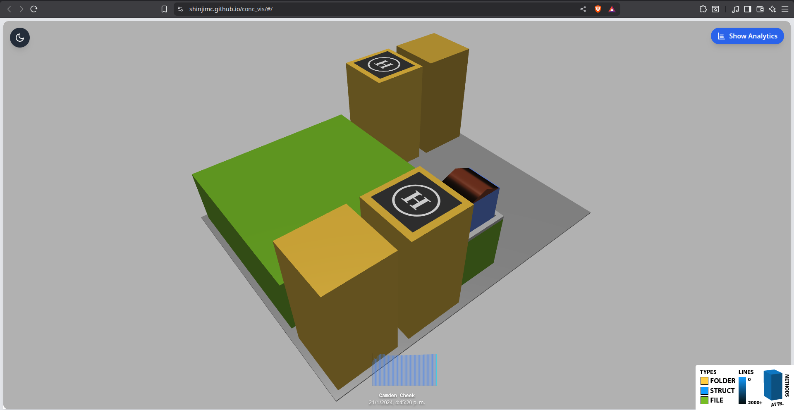
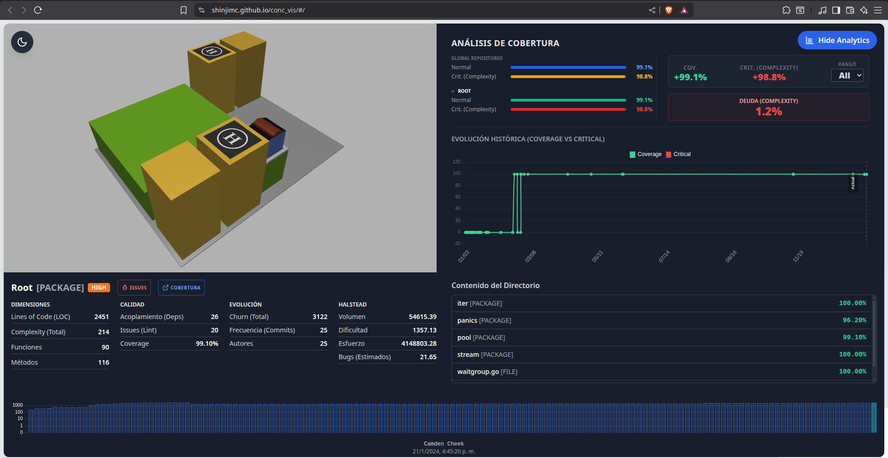

# HeatMetro: Viewer

> **[Leer en Español](https://www.google.com/search?q=%23heatmetro-viewer-espa%C3%B1ol)**


---

## HeatMetro: Viewer (English)

**HeatMetro: Viewer** is the visualization layer of the HeatMetro ecosystem. It is a Single Page Application (SPA) built with **React.js** that utilizes **Babylon.js** to render software metrics as an interactive 3D City Metaphor.

Unlike traditional dashboards, this viewer is designed to be **stateless and deployable anywhere**. It consumes static JSON data generated from a `repositories.db` file and renders the 3D city directly in the browser.

> **Live Demo:** Want to see it in action? Check out a live example visualization here:
> **[View Live Demo](https://shinjimc.github.io/conc_vis/)**

### Previews





### Prerequisites: The Data

This viewer does not generate metrics on its own; it visualizes existing data.

1.  **To generate the Database (`repositories.db`):**
    You must use the extraction tool. Please visit: **[HeatMetro-Builder](https://github.com/ShinjiMC/HeatMetro-Builder)**

2.  **To generate the JSONs locally (Optional):**
    If you want to run the viewer locally without GitHub Actions, you can generate the JSON files manually:

    - Go to the **[Generator Branch](https://github.com/ShinjiMC/HeatMetro/tree/generator)**.
    - Place your `repositories.db` inside that generator project.
    - Run the script to generate the `data/` folder.
    - Copy the resulting `data/` folder into the `public/` directory of this frontend.

### Tech Stack

- **React.js**: Component-based UI structure.
- **Babylon.js**: Real-time 3D rendering engine for the city metaphor.
- **Vite**: Fast tooling and build process.

### Automated Deployment (GitHub Pages)

This viewer is designed to be deployed automatically via **GitHub Actions** in any repository that contains a valid `repositories.db`.

#### 1. Setup the Workflow

In the repository where your data resides (the one containing your `repositories.db`), create a file at `.github/workflows/heatmetro.yml` and paste the following content:

```yaml
name: Generate & Deploy HeatMetro

on:
  push:
    branches: ["main"]
  workflow_dispatch:

permissions:
  contents: write

jobs:
  deploy:
    runs-on: ubuntu-latest
    steps:
      # 1. Checkout Data Repo (Where repositories.db is)
      - name: Checkout Data Repo
        uses: actions/checkout@v4

      # 2. Checkout Generator Scripts
      - name: Checkout Generator Scripts
        uses: actions/checkout@v4
        with:
          repository: ShinjiMC/HeatMetro
          ref: generator
          path: scripts

      # 3. Setup Node.js
      - name: Setup Node
        uses: actions/setup-node@v4
        with:
          node-version: "20"

      # 4. Generate JSON Data
      - name: Generate JSON Data
        run: |
          echo "Moving database..."
          cp repositories.db scripts/repositories.db
          echo "Installing dependencies and generating..."
          cd scripts
          npm install
          node json.js
          if [ ! -d "data" ]; then
            echo "Error: Data folder was not generated."
            exit 1
          fi

      # 5. Download Frontend Build (Release)
      - name: Download Frontend Build
        run: |
          echo "⬇Downloading frontend release..."
          wget -O frontend.zip https://github.com/ShinjiMC/HeatMetro/releases/download/v1.0.0/dist.zip
          echo "Unzipping..."
          unzip frontend.zip -d public_site

      # 6. Inject Data into Frontend
      - name: Inject Data
        run: |
          echo "Injecting data into static site..."
          mkdir -p public_site/data
          cp -r scripts/data/* public_site/data/
          echo "Final structure ready."

      # 7. Deploy to GitHub Pages
      - name: Deploy to GitHub Pages
        uses: JamesIves/github-pages-deploy-action@v4
        with:
          folder: public_site
          branch: gh-pages
```

#### 2. Configure GitHub Pages

Once the pipeline has run successfully for the first time, a new branch named `gh-pages` will be created.

1.  Go to your repository **Settings** -\> **Pages**.
2.  Under **Build and deployment**, select **Source**: `Deploy from a branch`.
3.  Select **Branch**: `gh-pages` and folder `/(root)`.
4.  Click **Save**.

### Local Development

If you wish to contribute to the viewer code:

1.  Clone this repository.
2.  Install dependencies: `npm install`
3.  Run the development server: `npm run start`

---

## HeatMetro: Viewer (Español)

**HeatMetro: Viewer** es la capa de visualización del ecosistema HeatMetro. Es una aplicación de página única (SPA) construida con **React.js** que utiliza **Babylon.js** para renderizar métricas de software como una Metáfora de Ciudad 3D interactiva.

A diferencia de los paneles tradicionales, este visor está diseñado para ser **sin estado (stateless) y desplegable en cualquier lugar**. Consume datos JSON estáticos generados a partir de un archivo `repositories.db` y renderiza la ciudad 3D directamente en el navegador.

> **Demo en Vivo:** ¿Quieres verlo en acción? Revisa un ejemplo de visualización en vivo aquí:
> **[Ver Demo en Vivo](https://shinjimc.github.io/conc_vis/)**

### Vistas Previas


### Requisitos: Los Datos

Este visor no genera métricas por sí mismo; visualiza datos existentes.

1.  **Para generar la Base de Datos (`repositories.db`):**
    Debes utilizar la herramienta de extracción. Visita: **[HeatMetro-Builder](https://github.com/ShinjiMC/HeatMetro-Builder)**

2.  **Para generar los JSONs localmente (Opcional):**
    Si deseas ejecutar el visor en tu PC sin GitHub Actions, puedes generar los archivos manualmente:

    - Ve a la **[Rama Generator](https://github.com/ShinjiMC/HeatMetro/tree/generator)**.
    - Coloca tu archivo `repositories.db` dentro de ese proyecto.
    - Ejecuta el script para generar la carpeta `data/`.
    - Copia la carpeta resultante `data/` dentro del directorio `public/` de este frontend.

### Tecnologías

- **React.js**: Estructura de interfaz basada en componentes.
- **Babylon.js**: Motor de renderizado 3D en tiempo real.
- **Vite**: Herramientas de construcción rápida.

### Despliegue Automatizado (GitHub Pages)

Este visor se despliega automáticamente mediante **GitHub Actions** en cualquier repositorio que contenga un `repositories.db` válido.

#### 1. Configurar el Workflow

En el repositorio donde están tus datos (el que tiene el `repositories.db`), crea un archivo en `.github/workflows/heatmetro.yml` y pega el siguiente contenido:

```yaml
name: Generate & Deploy HeatMetro

on:
  push:
    branches: ["main"]
  workflow_dispatch:

permissions:
  contents: write

jobs:
  deploy:
    runs-on: ubuntu-latest
    steps:
      # 1. Bajar el Repo de Datos
      - name: Checkout Data Repo
        uses: actions/checkout@v4

      # 2. Bajar Scripts del Generador
      - name: Checkout Generator Scripts
        uses: actions/checkout@v4
        with:
          repository: ShinjiMC/HeatMetro
          ref: generator
          path: scripts

      # 3. Configurar Node.js
      - name: Setup Node
        uses: actions/setup-node@v4
        with:
          node-version: "20"

      # 4. Generar Datos JSON
      - name: Generate JSON Data
        run: |
          echo "Moviendo base de datos..."
          cp repositories.db scripts/repositories.db
          echo "Instalando dependencias y generando..."
          cd scripts
          npm install
          node json.js
          if [ ! -d "data" ]; then
            echo "Error: La carpeta data no se generó."
            exit 1
          fi

      # 5. Descargar Build del Frontend (Release)
      - name: Download Frontend Build
        run: |
          echo "⬇Descargando release..."
          wget -O frontend.zip https://github.com/ShinjiMC/HeatMetro/releases/download/v1.0.0/dist.zip
          echo "Descomprimiendo..."
          unzip frontend.zip -d public_site

      # 6. Inyectar Datos en el Frontend
      - name: Inject Data
        run: |
          echo "Inyectando datos en el sitio estático..."
          mkdir -p public_site/data
          cp -r scripts/data/* public_site/data/
          echo "Estructura final lista."

      # 7. Desplegar a GitHub Pages
      - name: Deploy to GitHub Pages
        uses: JamesIves/github-pages-deploy-action@v4
        with:
          folder: public_site
          branch: gh-pages
```

#### 2. Configurar GitHub Pages

Una vez que el pipeline corra con éxito:

1.  Ve a **Settings** -\> **Pages** en tu repositorio.
2.  En **Build and deployment**, selecciona **Source**: `Deploy from a branch`.
3.  Elige la rama `gh-pages` y carpeta `/(root)`.
4.  Guarda los cambios.

### Desarrollo Local

Si deseas contribuir al código:

1.  Clona este repositorio.
2.  Instala dependencias: `npm install`
3.  Corre el servidor: `npm run start`

---

## Author

- **Braulio Nayap Maldonado Casilla** - [GitHub Profile](https://github.com/ShinjiMC)
